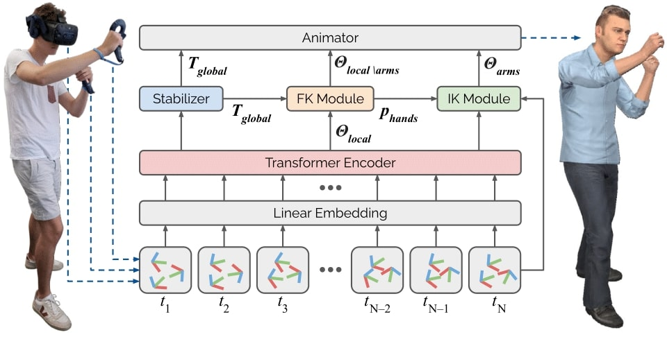

## AvatarPoser: Articulated Full-Body Pose Tracking from Sparse Motion Sensing (ECCV 2022, Official Code)

[Jiaxi Jiang<sup>1</sup>](https://www.jiaxi-jiang.com/), [Paul Streli<sup>1</sup>](https://www.paulstreli.com), Huajian Qiu<sup>1</sup>, [Andreas Fender<sup>1</sup>](http://www.andreasfender.com/), Larissa Laich<sup>2</sup>, [Patrick Snape<sup>2</sup>](http://patricksnape.github.io/), [Christian Holz<sup>1</sup>](https://www.christianholz.net)<br/>

<sup>1</sup> [Sensing, Interaction & Perception Lab](https://siplab.org), Department of Computer Science, ETH Zürich, Switzerland <br/>
<sup>2</sup> Reality Labs at Meta, Zurich, Switzerland <br/>
<p align="center">
</p>

___________


<p align="center">

</p>

News
----------
:fire::fire: __2024-07:__ Our follow-up work [EgoPoser](https://github.com/eth-siplab/EgoPoser) is accepted by ECCV 2024! __EgoPoser__ focuses on egocentric inside-out body tracking by spatio-temporal
 motion decomposition, hand-tracking modeling, and body shape estimation.

:fire::fire: __2024-07:__ Our follow-up work [MANIKIN](https://static.siplab.org/papers/eccv2024-manikin.pdf) is accepted by ECCV 2024! __MANIKIN__ focuses on biomechanically accurate body modeling and efficient neural inverse kinematics.

:rocket::rocket: __2024-06:__ __AvatarPoser__ serves as a ***state-of-the-art*** method on the [Nymeria](https://www.projectaria.com/datasets/nymeria/) dataset (ECCV 2024). Nymeria is the world's largest human motion dataset, with egocentric videos recorded using Meta's Aria glasses.

:rocket::rocket: __2023-10:__ __AvatarPoser__ serves as a ***state-of-the-art*** method on the [Ego-Exo4D](https://ego-exo4d-data.org/) dataset (CVPR 2024). Ego-Exo4D is a large-scale multimodal dataset designed for multiple tasks based on egocentric videos recorded using Meta's Aria glasses.

:loudspeaker::loudspeaker: __2023-08:__ We release our follow-up work [EgoPoser](https://github.com/eth-siplab/EgoPoser) for egocentric inside-out body tracking on Arxiv. 

:loudspeaker::loudspeaker: __2022-10:__  __AvatarPoser__ was also honored as one of eleven [ECCV 2022 demonstrations](https://eccv2022.ecva.net/program/demo-list/). Videos are available on the [project page](https://siplab.org/projects/AvatarPoser).

:fire::fire: __2022-07:__ __AvatarPoser__ is accepted by ECCV 2022, and our code is publicly available! We are the first method that can generate various full-body motions using only head and hand tracking signals. We now have ***full-body avatars*** in Metaverse! 


---

Abstract
----------
> Today's Mixed Reality head-mounted displays track the user's head pose in world space as well as the user's hands for interaction in both Augmented Reality and Virtual Reality scenarios. While this is adequate to support user input, it unfortunately limits users' virtual representations to just their upper bodies. Current systems thus resort to floating avatars, whose limitation is particularly evident in collaborative settings. To estimate full-body poses from the sparse input sources, prior work has incorporated additional trackers and sensors at the pelvis or lower body, which increases setup complexity and limits practical application in mobile settings. In this paper, we present AvatarPoser, the first learning-based method that predicts full-body poses in world coordinates using only motion input from the user's head and hands. Our method builds on a Transformer encoder to extract deep features from the input signals and decouples global motion from the learned local joint orientations to guide pose estimation. To obtain accurate full-body motions that resemble motion capture animations, we refine the arm joints' positions using an optimization routine with inverse kinematics to match the original tracking input. In our evaluation, AvatarPoser achieved new state-of-the-art results in evaluations on large motion capture datasets (AMASS). At the same time, our method's inference speed supports real-time operation, providing a practical interface to support holistic avatar control and representation for Metaverse applications.
<p align="center">
  
</p>


Contents
----------

* [Datasets](#datasets)
* [Training](#training)
* [Testing](#testing)
* [Pretrained Models](#pretrained-models)
* [Citation](#citation)
* [License and Acknowledgement](#license-and-acknowledgement)

Datasets
----------
1. Please download the datasets `BMLrub`, `CMU`, and `HDM05` from [AMASS](https://amass.is.tue.mpg.de/index.html).
2. Download the required body model and placed them in `support_data/body_models` directory of this repository. For SMPL+H body model, download it from http://mano.is.tue.mpg.de/. Please download the AMASS version of the model with DMPL blendshapes. You can obtain dynamic shape blendshapes, e.g. DMPLs, from http://smpl.is.tue.mpg.de
3. (Optional) If you want to have new random data split, run `generate_split.py`
4. Run `prepare_data.py` to preprocess the input data for faster training. The data split for training and testing data in our paper is stored under the folder `data_split`.

Training
----------
For training, please run:
```
python main_train_avatarposer.py -opt options/train_avatarposer.json
```
Testing
----------
For testing, please run:
```
python main_test_avatarposer.py
```
Pretrained Models
----------
Click [Pretrained Models](https://github.com/eth-siplab/AvatarPoser/releases/download/v1.0/avatarposer.pth) to download our pretrained model for AvatarPoser, and put it into `model_zoo`.

Citation
----------
If your find our paper or codes useful, please cite our work:

    @inproceedings{jiang2022avatarposer,
      title={AvatarPoser: Articulated Full-Body Pose Tracking from Sparse Motion Sensing},
      author={Jiang, Jiaxi and Streli, Paul and Qiu, Huajian and Fender, Andreas and Laich, Larissa and Snape, Patrick and Holz, Christian},
      booktitle={Proceedings of European Conference on Computer Vision},
      year={2022},
      organization={Springer}
    }

License and Acknowledgement
----------
This project is released under the MIT license. We refer to the code framework in  [FBCNN](https://github.com/jiaxi-jiang/FBCNN/) and [KAIR](https://github.com/cszn/KAIR) for network training. 
